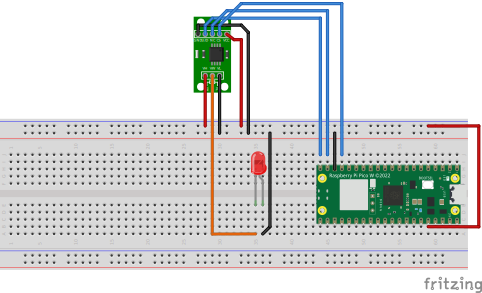

# Digital Control of X9C103S POT

Aim is to Digitally control the POT and exploring its functionality
The POT has the following control signals,

## Circuit 

Skip to [Key Takeaways](#key-takeaways) for a TLDR of X9C103S control.

## Symbol Descriptions

`U/~D` Up Down, control direction of wiper movement

`~INC` increment, negative edge triggered toggling whether wiper will increment or decrement depending on logic of the `U/D` input.

`~CS`Chip Select, Current Counter Value is stored in nonvolatile memory. Once stored the device is put into low power standby until the digital pot control is selected once again.

$V_w$ Wiper output

$V_l$ Low voltage

$V_H$ high voltage

## Mode Selection 

| ~CS| ~INC | U/~D | Mode |
| --- | --- | --- | --- |
| L | Negative Edge | H | Wiper Up |
| L | Negative Edge | L | Wiper Down | 
| Positive Edge | H | X | Store Wiper Position | 
| H | X | X | Standby Current | 
| Positive Edge | L | X | No Store, Return to Standby | 

>[!warning]
>
>Supply Voltage Operational Limits:  $5V\ \pm 10$%

## IMPORTANT: Timings

| Parameter                   | Min | Typ | Max | Units             |
|      ---                    | --- | --- | --- |   ---             |
| CS to INC setup             | 100 |     |     | ns                |
| INC HIGH to U/D change      | 100 |     |     | ns                |
| U/D to INC setup            | 2.9 |     |     | $\mu s$           |
| INC LOW period              | 1   |     |     | $\mu s$           | 
| INC HIGH period             | 1   |     |     | $\mu s$           |
| INC Inactive to CS Inactive | 1   |     |     | $\mu s$           |
| CS deselect time            | 20  |     |     | ms                |
| INC to $V_w$ Change         |     | 100 | 500 | $\mu s$           |
| INC Cycle Time              | 4   |     |     | $\mu s$           |
| INC Rise and Fall Time      |     |     | 500 | $\mu s$           |
| Power Up to Wiper Stable    |     |     | 500 | $\mu s$           |
| $V_{cc}$ Power up Rate      | 0.2 |     | 50  | $\frac{mV{\mu S}$ |

### Key Takeaways

Operational Voltages
- HIGH: `INC`,`CS`, `U\D` Min: 2V, MAX: VCC + 1
- LOW: `INC`,`CS`, `U\D` Min: -1V, MAX: 0.8

Operational Current
- $I_{CC}$, $V_{CC}$ Active Current, TYP: 1 mA, MAX: 3mA 

#### Wiper Control
Wiper Increments in $101\Omega$
Min Resistance $40\Omega$
Max Resistance $10k\Omega$

Control Signal Timings:
- A sleep for $500 \mu s$ is needed to stabilise the wiper, see ``utimer`` lib for MicroPython
- Changing any of the ``~INC``, ``U/~D`` signals need to occur within $>100ns$ 
- ``INC`` Periods need to last at least for $1 \mu s$
- Any Change to ``U/~D`` is accompanied by a sleep of $2.9 \mu s$
- Maximum Pulse Rate (Cycle time) for ``INC`` is $4 \mu s$

#### Non-Voltatile memory handling

- Any Change to `~CS` needs to last $> 20 ms$ 
- Any Change to ``INC`` after changing `~CS` need to have $100 ns$ delay between them

